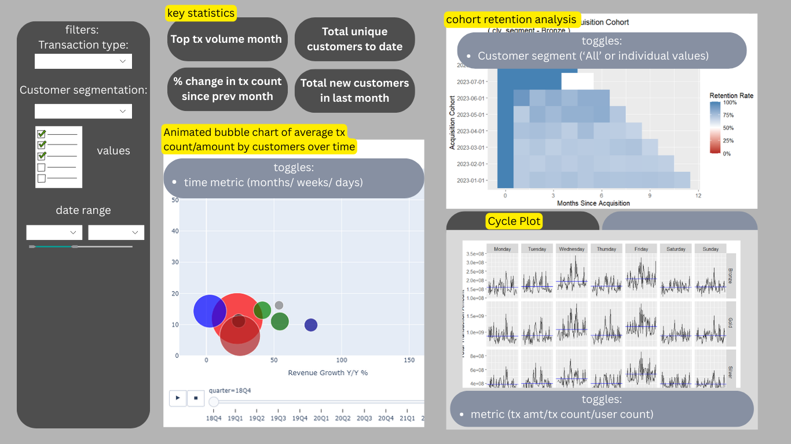
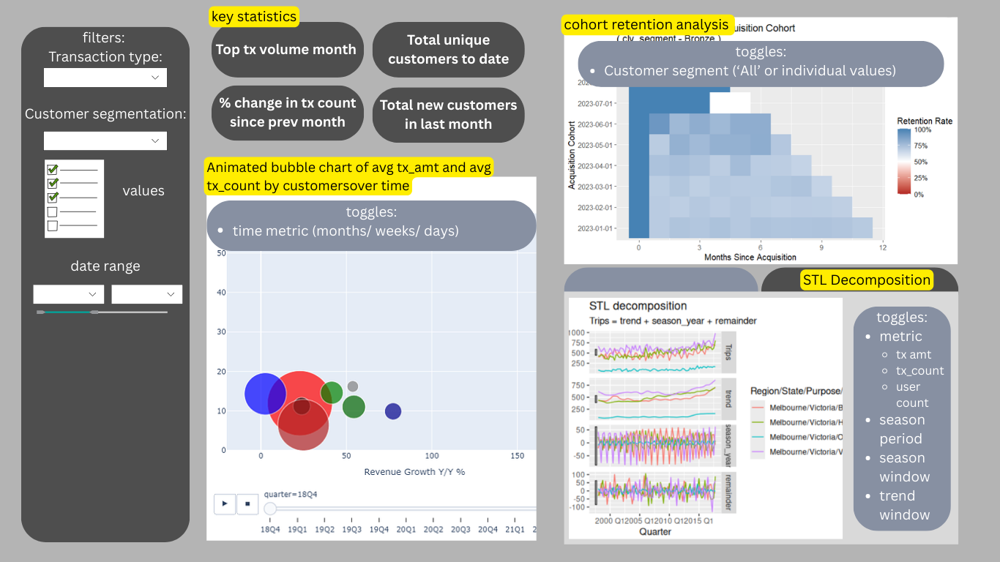
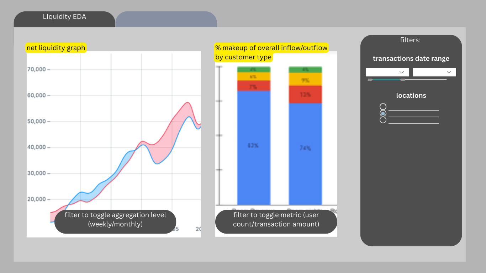
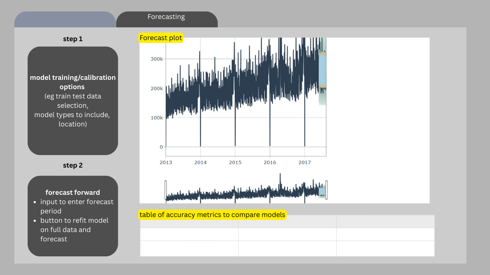

## Overview

For the ISSS608 Visual Analytics Project, we will use the Colombian Fintech Financial Analytics (COFINFAD) dataset to build an interactive web application allowing users to explore and utilise the dataset effectively and easily. The application will contain three main modules, covering confirmatory data analysis to understand how groups of customers differ in their adoption of fintech services; clustering to explore how to characterise key groups of fintech consumers, and time-oriented analysis to understand the transaction behaviour of fintech consumers over time as well as predict the liquidity needs of the fintech provider.

We have selected the *Time-Oriented Analysis of Transaction Behaviour* of the proposed Shiny application for the ISSS608 Visual Analytics Project. In this exercise, we will complete the following tasks:

-   Evaluate and determine the necessary R packages needed,
-   Prepare and test the specific R codes can be run and returned the correct visual output as expected,
-   Determine the parameters and outputs that will be exposed on the Shiny applications, and
-   Select the appropriate Shiny UI components for exposing the parameters determine above.

## Import R Packages

The following R packages will be used:

+------------+----------------------------------------------------------------------------------------+--------------------+
| R Package  | Purpose                                                                                | Used in Shiny App? |
+============+========================================================================================+====================+
| tidyverse  | .Provides functions for data manipulation and visualisation                            | yes                |
+------------+----------------------------------------------------------------------------------------+--------------------+
| knitr      | Provides functions for publisher-quality static tables                                 | no                 |
+------------+----------------------------------------------------------------------------------------+--------------------+
| DT         | Provides functions for interactive, sortable and searchable tables                     | yes                |
+------------+----------------------------------------------------------------------------------------+--------------------+
| tsibble    | Provides a data infrastructure for tidy temporal data with wrangling tools             | yes                |
+------------+----------------------------------------------------------------------------------------+--------------------+
| fable      | Provides modelling framework to estimate time series data using tsibble data           | yes                |
+------------+----------------------------------------------------------------------------------------+--------------------+
| feasts     | Provides functions for generating cycle plots and decomposing time series data         | yes                |
+------------+----------------------------------------------------------------------------------------+--------------------+
| lubridate  | Provides functions to parse and manipulate dates and datetimes                         | yes                |
+------------+----------------------------------------------------------------------------------------+--------------------+
| tidymodels | Provides functions for modeling and machine learning in r                              | yes                |
+------------+----------------------------------------------------------------------------------------+--------------------+
| timetk     | Provides functions for visualising and analysing time-series data.                     | yes                |
+------------+----------------------------------------------------------------------------------------+--------------------+
| modeltime  | extension to tidymodels which provides a unified framework for time series forecasting | yes                |
+------------+----------------------------------------------------------------------------------------+--------------------+
| rlang      | provides functions to work with base types and core R features                         | yes                |
+------------+----------------------------------------------------------------------------------------+--------------------+

The following code chunk imports and loads the necessary packages for this exercise

```{r}
pacman::p_load(tidyverse, knitr, DT, tsibble, 
               fable, feasts, plotly, lubridate,
               tidymodels, timetk, modeltime, rlang)
```

## Import Data

The COFINFAD dataset covers 12 months of transaction data collected from over 48,000 customers from a Colombian fintech company in 2023. The following code chunks load in the customer and transaction data into R for further processing. We can then preview the data and see an overview of the data types of each columns with `str()`.

::: panel-tabset
### Customer data

```{r}
customers <- read_csv('data/aspatial/customer_data.csv')
```

```{r}
str(customers)
```

### Transaction data

```{r}
transactions <- read_csv('data/aspatial/transactions_data.csv')
```

```{r}
str(transactions)
```
:::

## Storyboard

The following images demonstrate the planned layout for the module, which will consist of two main pages:

1.  **Dashboard** - Explore the transaction behaviour of customers over time

2.  **Cashflow analysis** - Explore past trends in net cashflow based on customer transactions and forecast future cashflow

### Dashboard





The dashboard will consist of 5 main sections.

1.  General Filters - These will manipulate dataset that the figures and graphs are based on, allowing users to focus on specific subsections of data they are interested in such.

2.  Key statistics - This will highlight some key statistics from the subset of data being analysed

3.  Animated bubble chart - This will allow users to understand visualise how the distribution of customers according to the selected segmentation variable and the average transaction behaviour of customers within each segment has changed over time.

4.  Cohort retention heatmap - This allows customers to visualise the percentage of returning customers making transactions from each monthly cohort of new customers.

5.  Cycle Plot/STL Decomposition plot - These allow the users to explore possible seasonal/cyclical patterns in transaction behaviour

### Cashflow Analysis



The first tab of the cashflow analysis consists of two graphs. The first graph plots the amounts of cash inflow/outflow based on the transaction data, and produces a color-coded shaded area representing net inflow or net outflow. The second graph breaks down inflow and outflow contributions by customer segment.



The second tab of the cashflow analysis provides a simple user interface for users to train and test various forecasting models to predict upcoming cashflow.

## Dashboard filters

For the various graphs to be generated, we will allow the following general filters to be applied to the dataset:

+----------------------+----------------------------------------------------------------------+----------------------------------------------------------------------------------+----------------------------------------------------------------------------------------------+
| Filter               | Shiny widget type                                                    | Values                                                                           | Function                                                                                     |
+======================+======================================================================+==================================================================================+==============================================================================================+
| Transaction Type     | radioButtons()                                                       | values from `Type` in *transactions*                                             | Allow users to filter what sort of transaction behaviour from customers they want to analyse |
+----------------------+----------------------------------------------------------------------+----------------------------------------------------------------------------------+----------------------------------------------------------------------------------------------+
| Customer type filter | selectInput() for selecting variable                                 | `gender` in *customers*                                                          | Allow users to select how to group the customer base for comparison between groups           |
|                      |                                                                      |                                                                                  |                                                                                              |
|                      |                                                                      | `acquisition_channel` in *customers*                                             |                                                                                              |
|                      |                                                                      |                                                                                  |                                                                                              |
|                      |                                                                      | `customer_segment` in *customers*                                                |                                                                                              |
|                      |                                                                      |                                                                                  |                                                                                              |
|                      |                                                                      | `location` in *customers*                                                        |                                                                                              |
|                      |                                                                      |                                                                                  |                                                                                              |
|                      |                                                                      | `clv_segment` in *customers*                                                     |                                                                                              |
|                      |                                                                      |                                                                                  |                                                                                              |
|                      |                                                                      | `income_bracket` in *customers*                                                  |                                                                                              |
+----------------------+----------------------------------------------------------------------+----------------------------------------------------------------------------------+----------------------------------------------------------------------------------------------+
|                      | checkboxGroupInput() for selecting specific values within a variable | values from variables in preceding row, depending on which variable was selected | Allow users to select the exact segment of customer base to analyse                          |
+----------------------+----------------------------------------------------------------------+----------------------------------------------------------------------------------+----------------------------------------------------------------------------------------------+
| Date range filter    | dateRangeInput()                                                     | 1 Jan 2023 - 31 Dec 2023                                                         | Allow users to select the date range of transaction data to analyse                          |
+----------------------+----------------------------------------------------------------------+----------------------------------------------------------------------------------+----------------------------------------------------------------------------------------------+

### Functions to filter data

The following code chunks create functions to filter data based on the user input, making use of various data manipulation functions from **dplyr** package. This will be utilised in the shiny app to pre-filter the dataset before performing further computations/displaying the graphs.

::: panel-tabset
#### Transaction date range

```{r}
filter_tx_dates<- function(data=transactions, start_date, end_date){
   result <- data %>%
     filter(date>=ymd(start_date),
            date<=ymd(end_date))
   
   return(result)
}
```

Testing the function

```{r}
filtered_tx_dates <- filter_tx_dates(transactions, "2023-01-01", "2023-3-30")
kable(summary(filtered_tx_dates))

```

#### Transaction type

```{r}
filter_tx <- function(data, selected_type='All'){
 if(selected_type!='All'){
    result <- data %>%
      filter(type==selected_type)
    return(result)
 }
  else {
    return(transactions)
  }
}
```

Testing the function

```{r}
filtered_tx <- filter_tx(transactions, selected_type="Payment")
kable(head(filtered_tx))
```

#### Customer type

First, we will factorise some of the columns of interest for use for filtering, to ensure that later visualisations will order the values correctly.

```{r}
customers <- customers %>%
  mutate(
    across(customer_segment, ~ factor(.x, levels = c("inactive", "occasional", "regular", "power"))),
    across(clv_segment, ~ factor(.x, levels = c("Bronze", "Silver", "Gold", "Platinum"))),
    across(income_bracket, ~ factor(.x, levels = c("Low", "Medium", "High", "Very High")))
  )
```

When creating the filter for selecting which specific customer segments to include in the analysis and visualisation, we should keep in mind that Shiny check box group widgets will return the inputs as a character vector. Similarly, when choosing the column name, we will store the value of the input as a string. As such, we need to ensure that the function can accept the string/character vector values and parse them correctly to output the desired dataset.

-   For column selection, **tidyverse** allows us to use `.data[[colName]]` to indirectly access the variable where colName is the name of the column

-   `%in%` operator performs element wise comparison with all values in the character vector, returning TRUE there is at least one match in the character vector.

-   We also use `!identical()` to check if selected_value is 'All' instead of `==` as `==` is not valid for comparison with a character vector.

```{r}
filter_customer <- function(data, selected_type, selected_value){
  
  selected_cols <- data %>%
    select(customer_id, all_of(selected_type), first_tx)
  
  if (!identical(selected_value, 'All')){
    filtered_customers <- selected_cols %>%
    filter(.data[[selected_type]] %in% selected_value)
      return(filtered_customers)
    
  } else {
    return(selected_cols)
  }
}
```

Testing the function

```{r}
filtered_cust <- filter_customer(customers, selected_type='clv_segment',
                                 selected_value=c('Gold', 'Bronze', 'Silver'))
kable(head(filtered_cust))
```
:::

## Key Statistics

We have chosen four key statistics to display in the dashboard from the dataset. The code chunks in the panels below create functions which take in the filtered datasets to compute the desired statistic, using various data manipulation functions from **dplyr** package. We also test each function to check it is working as expected.

:::: panel-tabset
### Top Transactions Month

The following function uses an inner join to ensure that only transactions by the selected customer types are used to calculate the total number of transactions each month. A month column is then created using lubridate's `month()` function, then each row per month is counted to find the total number of transactions. Then, the dataframe is filtered for the row with the highest number of transactions and the month value in that row is extracted and returned.

```{r}
get_top_month <- function(tx_data, cust_data){
  
  result <- tx_data %>%
    inner_join(cust_data, by="customer_id")%>%
    mutate(month=month(date, label=TRUE))%>%
    group_by(month) %>%
    summarise(total_tx = n())%>%
    ungroup %>%
    filter(total_tx == max(total_tx))%>%
    pull(month)
  
  return(result)
}

print(get_top_month(transactions, customers))
print(get_top_month(filtered_tx, filter_customer(customers,"acquisition_channel", c("Paid Ad", "Partnership"))))
```

### % Change in Transaction Count

Similar to the code to find the top number of transactions per month, we first use an inner join to ensure only transactions by the customer segments of interest are included in the dataset. Then we extract the month of each transaction and group the data by month to calculate the total number of transactions per month.

In case the transaction data is filtered to only data from a time period that spans one month or less, we will include a response to display "N/A". Otherwise, we create a column storing the value of transactions in the previous month, and a column storing the percentage change in number of transactions since the previous month. Finally the last row (containing the latest month's data) is extracted and the value in the pct_change column is extracted and returned.

```{r}
get_tx_change <- function(tx_data, cust_data){
  
  monthly_tx <- tx_data %>%
    inner_join(cust_data, by="customer_id")%>%
    mutate(month=month(date, label=TRUE))%>%
    group_by(month) %>%
    summarise(total_tx = n())%>%
    ungroup 
  
  if (nrow(monthly_tx)==1) {
    result = "N/A"
  } else {
    result <-  monthly_tx %>%
      mutate(
        prev_tx = lag(total_tx),
        pct_change = (total_tx - prev_tx) / prev_tx
      ) %>%
      slice_tail(n = 1) %>%
      pull(pct_change) *100
  }
  
  return(result)
}

print(get_tx_change(transactions, customers))
print(get_tx_change(filtered_tx, filter_customer(customers, "acquisition_channel", c("Paid Ad", "Partnership"))))
print(get_tx_change(filter_tx_dates(transactions, '2023-01-01', '2023-01-31'), customers))
```

### New Customers in Last Month

First, we find the latest month based on the end date inputted by the user in the date range input. Next, we filter the customer data for customers whose first transactions occured before the end date, then group the filtered data by the month of their first transaction to count the number of new users that month. Finally we filter for the correct month and extract the count of new users.

```{r}
get_new_cust <- function(tx_data, cust_data, end_date){

  latest_month <- month(ymd(end_date))
  
  result <- cust_data %>%
    inner_join(tx_data, by = "customer_id")%>%
    filter(first_tx <= ymd(end_date)) %>%
    mutate(month = month(first_tx)) %>%
    group_by(month) %>%
    summarise(new_users=n_distinct(customer_id))%>%
    ungroup()%>%
    filter(month == latest_month)%>%
    pull(new_users)
  
  return(result)
}

print(get_new_cust(transactions, customers, "2023-12-31"))
print(get_new_cust(filtered_tx_dates, filtered_cust, "2023-03-30"))
```

### Total Customers to date

We first filter the customer data to only those whose first transactions occurred before the end of the date range, then count the number of customers.

::: callout-note
Since this function counts the total unique customers the company has at the point of the end of the date range studied, there is no need to filter the customer dataset or join the customer data set with the transaction dataset.
:::

```{r}

get_total_cust <- function(end_date, cust_data){
  cust_count <- cust_data %>%
    filter(first_tx <= ymd(end_date)) %>%
    nrow()
}

print(get_total_cust("2023-12-31", customers))
print(get_total_cust("2023-2-28", customers))
```
::::

## Animated Bubble Chart

The first chart to display on the dashboard will be the animated bubble chart. This will allow us to visualise multiple variables simultaneously:

1.  Average transaction value (x-axis)
2.  Average transaction count (y-axis)
3.  Count of customers (bubble size)
4.  Segments of customers (colour of bubbles)
5.  Time (individual frames/animation)

This will give users a useful snapshot to spot any trends or outliers in how the transaction behaviour of a customer segment changes over the period of time studied.

### Filter

+-------------+-------------------+-----------+--------------------------------------------------------------------------------------------------------------------------------------------+
| Filter      | Shiny widget type | Values    | Function                                                                                                                                   |
+=============+===================+===========+============================================================================================================================================+
| Time metric | radioButtons()    | -   month | Allow users to select whether to aggregate data on a monthly or weekly basis to view changes in average transaction behaviour of customers |
|             |                   | -   week  |                                                                                                                                            |
+-------------+-------------------+-----------+--------------------------------------------------------------------------------------------------------------------------------------------+

The following code chunk will take in the following variables as inputs to prepare the data for the bubble plot.

-   filtered customer data (*tx_df*)
-   filtered transaction data (*cust_df*)
-   variable used to segment customers (*selected_type*)
-   time metric to aggregate data (time_metric)

The function uses an inner join to combine only eligible rows from the transaction and customer datasets. Then it groups the data by the relevant metric (month/week) and customer segment, and calculates the average transaction value, average transaction counts, and number of unique customers for each group.

```{r}
get_animation_data <- function(tx_df, cust_df,  selected_type, time_metric){   
  if (time_metric=="month"){     
    result <- tx_df %>%       
      inner_join(cust_df, by = "customer_id") %>%       
      mutate(month = month(date, label=TRUE)) %>%       
      group_by(month, .data[[selected_type]]) %>%       
      summarise(         
        avg_tx_value = mean(amount),
        avg_tx_count = n()/n_distinct(customer_id),
        unique_customers = n_distinct(customer_id),
        .groups = 'drop'         
      ) 
    
  } else if (time_metric=="week"){     
      result <- tx_df %>%       
        inner_join(cust_df, by = "customer_id") %>%       
        mutate(week = yearweek(date)) %>%       
        group_by(week, .data[[selected_type]]) %>%       
        summarise(         
          avg_tx_value = mean(amount),         
          avg_tx_count = n()/n_distinct(customer_id),         
          unique_customers = n_distinct(customer_id),         
          .groups = 'drop'         
        )   
  }    
  return(result) 
  }
```

Next we test the function.

```{r}
animated_data <- get_animation_data(transactions, customers, "gender", "week")
kable(head(animated_data, 9))
```

### Create visualisation

The following code chunk creates a function which takes in the following variables to output the bubble chart

-   prepared animation data (*data*)
-   variable used to segment customers (*selected_type*)
-   time metric to aggregate data (*time_metric*)

Before creating the plot, we create a column *frame_id* as year-week objects from lubridate will be shown as a large integer instead of '2023 W01' for example. By converting the object to a string under *frame_id*, this preserves the label on the rendered graph. Then, we use ggplot to create the static plots which will make up each frame of the animated graph.

-   `text` argument is used to later pass into the tooltip of the animated plot to display the desired information upon hovering on a bubble
-   `geom_point()` is used to create the bubble plots

```{r}
get_bubble_plot <- function(data, selected_type, time_metric){
  
  if (time_metric=="week"){
    data<- data %>% 
      mutate(frame_id=as.character(week))
  } else if (time_metric=="month"){
    data <- data %>%
      mutate(frame_id=month)
  }
  
  result <- ggplot(data, 
                   aes(x = avg_tx_value,
                       y = avg_tx_count,
                       size = unique_customers,
                       text = paste(!!sym(selected_type), 
                         "<br>Number of customers:" , unique_customers,
                         "<br>Average transaction value:",
                         prettyNum(avg_tx_value,
                                   big.mark = ",",
                                   scientific = FALSE),
                         "<br>Average transaction count:",
                         round(avg_tx_count,2)
                       ))) +     
    geom_point(aes(size=unique_customers,
                   color = !!sym(selected_type),
                   ids = !!sym(selected_type),
                   frame = frame_id
                   ),
               alpha = 0.7, show.legend = FALSE) +     
    theme_grey() +     
    labs(title = "User Transaction Behaviour over Time",          
         x = "Average User Transaction Value",          
         y = "Average User Transaction Counts") 
  
  return(result) }
```

When rendering the graph, we will use `ggplotly()` to ensure the output is an interactive animated graph.

::: panel-tabset
#### Week

```{r}
#| warning: false
#| code-fold: true

p <- get_bubble_plot(animated_data, "gender", "week")  

ggplotly(p, tooltip="text")
```

#### Month

```{r}
#| warning: false 
#| code-fold: true

animated_data <- get_animation_data(transactions, customers, "gender", "month")
p <- get_bubble_plot(animated_data, "gender", "month")

ggplotly(p, tooltip="text")
```
:::

## Cohort Retention Heatmap

Cohort retention heatmaps segment customers into cohorts based on their start date, and tracks what percentage of each cohort returns in subsequent periods. This will allow users to identify if users are consistently coming back to utilise the fintech product for their transactions, or if there is any change in customer retention (eg if after a promotion occurs in March, cohort retention for the March/subsequent batches is particularly high).

As our data only covers a period of one year, we will standardise that one period/cohort comes from a single month.

### Filter

+-------------------------+-------------------+------------------------------------------------------+---------------------------------------------------------------------------------------------------------------------------------------+
| Filter                  | Shiny widget type | Values                                               | Function                                                                                                                              |
+=========================+===================+======================================================+=======================================================================================================================================+
| Customer segment filter | Radio buttons     | -   ‘All’                                            | Allow users to toggle cohort retention analysis of specific segments to facilitate comparing retention rates across customer segments |
|                         |                   |                                                      |                                                                                                                                       |
|                         |                   | -   Values of variable used to segment customer base |                                                                                                                                       |
+-------------------------+-------------------+------------------------------------------------------+---------------------------------------------------------------------------------------------------------------------------------------+

The following code chunk will take in the following variables as inputs to prepare the data for the bubble plot.

-   filtered customer data (*tx_df*)
-   filtered transaction data (*cust_df*)
-   variable used to segment customers (*selected_type*)
-   specific segment of customers (*segment_value*)

The function performs the following:

-   Filters customer data to selected segment (if needed)
-   Joins the customer data and transaction data\
    finds the month of the customer's first transaction (*cohort month)*, the month of the current transaction *(activity month)*, and finds the difference in months between the two values *(month_number)*
-   Groups the data by cohort month and month number, and calculates the number of active users by calculating the number of distinct customer ids in that group. (*cohort_counts*)
-   Finds the initial cohort sizes of each cohort by filtering for the first month for each cohort (i.e., month_number==0) *(initial_cohorts)*
-   finds retention percentage for each row in *cohort_counts* by finding the ratio of active users to initial cohort size *(retention matrix)*

```{r}
get_cohort_data <- function(tx_df, cust_df, selected_type, segment_value){
  if (segment_value != 'All'){
    cust_data <- cust_df %>%
      filter(.data[[selected_type]] == segment_value)
  }
  else{
    cust_data <- cust_df
  }
  
  cohort_counts  <- tx_df %>%
    inner_join(cust_data, by = "customer_id")%>%
    mutate(
      cohort_month = floor_date(first_tx, "month"),
      activity_month = floor_date(as.Date(date), "month"),
      month_number = (year(activity_month) - year(cohort_month)) * 12 + 
                 (month(activity_month) - month(cohort_month))
      ) %>%
    group_by(cohort_month, month_number) %>%
    summarise(active_users = n_distinct(customer_id), .groups = 'drop')
  
  initial_cohorts <- cohort_counts %>%
    filter(month_number == 0) %>%
    select(cohort_month, initial_users = active_users)
    
  retention_matrix <- cohort_counts %>%
    left_join(initial_cohorts, by = "cohort_month") %>%
    mutate(retention_pct = active_users / initial_users)
  
  return(retention_matrix)
}
```

Next we test the function.

```{r}
cohort_data <- get_cohort_data(transactions, 
                               filter_customer(customers, "acquisition_channel", "All"), 
                               "acquisition_channel", "Partnership")
kable(head(cohort_data))
```

### Create visualisation

The following code chunk will take in the following variables as inputs to create the heatmap.

-   prepared data (*cra_data*)
-   variable used to segment customers (*selected_type*)
-   specific segment of customers (*segment_value*)

The function below uses `geom_tile()` from **ggplot2** to create the heatmap. We also customise the gradient scale to a three-colour diverging palette using `scale_fill_gradient2()`.

```{r}
get_cra_heatmap <- function(cra_data, selected_type, segment_value) {
    
    if (segment_value=='All'){
      title_value=paste("Customer Retention by Acquisition Cohort (", 
                        selected_type, "-", segment_value, ")")
    } else{
      title_value=("Customer Retention by Acquisition Cohort")
    }
    
    result <- ggplot(cra_data, 
                     aes(x = month_number, 
                         y = factor(cohort_month), 
                         fill = retention_pct,,
                         text = paste0("Months since acquistion: ", month_number, "<br>Retention rate: ", round(retention_pct,2)))) +
      geom_tile() +
      scale_fill_gradient2(low = "firebrick",
                           mid = "white",
                          high = "steelblue",
                          midpoint = 0.5,
                          labels = scales::percent,
                          limits = c(0, 1)) +
      theme_grey() +
      labs(title = ifelse(segment_value=="All", "Customer Retention by Acquisition Cohort", paste("Customer Retention by Acquisition Cohort \n(", selected_type, "-", segment_value, ")")),
           subtitle = "Each cell represents the percentage of customers who made at \nleast one transaction in the months following their first transaction",
           x = "Months Since Acquisition",
           y = "Acquisition Cohort",
           fill = "Retention Rate")
    return(result)
}
```

::: panel-tabset
#### Acquisition channel (Partnership)

```{r}
#| code-fold: true

ggplotly(get_cra_heatmap(cohort_data, "acquisition_channel", "Partnership"), tooltip="text")
```

#### Acquisition channel (All)

```{r}
#| code-fold: true

cohort_data <- get_cohort_data(transactions,  
                               filter_customer(customers, "acquisition_channel", "All"), 
                               "acquisition_channel", "All")
ggplotly(get_cra_heatmap(cohort_data, "acquisition_channel", "All"), tooltip="text")
```
:::

## Seasonal Trend EDA

The final section of the dashboard will explore finding seasonal trends in the transaction data. Cycle plots group all data points from a particular season together to visualise possible trends or outliers within tha season. On the other hand, STL decomposition will allow users to identify overall trends and seasonal spikes, as well as how understand how much of variation should be attributed to seasonal trends and how much is random noise. As these are two different ways of understanding changes in seasonal trends of data, we will allow users to choose which type of plot to display in the dashboard using a panel tabset.

### Filter

+------------+-------------------+------------------------+----------------------------------------------------------------------------------------------+
| Filter     | Shiny widget type | Values                 | Function                                                                                     |
+============+===================+========================+==============================================================================================+
| Metric     | radioButtons()    | -   Transaction Amount | Allow users to select what sort of transaction behaviour from customers they want to analyse |
|            |                   | -   Transaction Count  |                                                                                              |
|            |                   | -   User Count         |                                                                                              |
+------------+-------------------+------------------------+----------------------------------------------------------------------------------------------+

The following code chunk will take in the following variables as inputs to prepare the data.

-   filtered customer data (tx_df)
-   filtered transaction data (cust_df)
-   variable used to segment customers (selected_type)
-   selected values of customer segments (selected_value)

As part of preparing the data, we will create the three different metrics to understand transaction behaviour

-   Transaction Amount (tx_amt)
-   Transaction Count (tx_count)
-   User Count (user_count)

The function below performs the following:

-   uses an inner join to combine the trasaction and customer data, then groups the data by the transaction date and the variable used to segment customers.
-   For each group, we then calculate the total number of transactions (*tx_amt*), total transaction amount (*tx_count*) and number of distinct user ids (*user_count*).

```{r}
get_seasonal_data <- function(tx_df, cust_df, selected_type, selected_value){
  result <- tx_df %>%
    inner_join(cust_df, by = "customer_id") %>%
    group_by(date, !!sym(selected_type)) %>%
    summarise(tx_count = n(),
            tx_amt = sum(amount),
            user_count = n_distinct(customer_id),
            .groups="drop") %>%
    mutate(!!sym(selected_type) := fct_drop(!!sym(selected_type)))%>%
    as_tsibble(index = date, 
               key = !!sym(selected_type))
}
```

Next we test the function.

```{r}
seasonal_data <- get_seasonal_data(filter_tx_dates(filtered_tx, 
                                                   '2023-01-01', 
                                                   '2023-12-31'), 
                                   filtered_cust, 
                                   "clv_segment")
kable(head(seasonal_data))
```

### Cycle Plot

The function to create the cycle plot takes in the prepared data and the metric of interest to quantify the transaction behaviour being analysed to create the cycle plot. Due to the data only spanning one year and being aggregated on a per-day basis, only a weekly cycle is appropriate. We use the `gg_subseries()` function from **feasts** package to generate the cycle plots.

```{r}
get_cycle_plot <- function (data, metric){
  if (metric == "tx_count"){
    titleText = "Transaction Count Cycle Plot"
    ylab = "Total Count of Transactions"
  } else if (metric == "tx_amt") {
    ylab = "Total Transaction Amount"
    titleText = "Transaction Amount Cycle Plot"
  } else if (metric == "user_count") {
    ylab = "Total Unique Customers"
    titleText = "User Count Cycle Plot"

  }
  
  result <- data %>% 
    gg_subseries(.data[[metric]], period="1 week") +
    labs(title=titleText,
      y=ylab, x='Date') +
    theme_grey()+
    theme(axis.text.x = element_blank(),
          axis.ticks.x=element_blank())
  
  return(result)
}
```

::: panel-tabset
#### Transaction Amount

```{r}
#| warning: false
#| code-fold: true

get_cycle_plot(seasonal_data, "tx_amt")
```

#### Transaction Count

```{r}
#| warning: false
#| code-fold: true

get_cycle_plot(seasonal_data, "tx_count")
```

#### User Count

```{r}
#| warning: false
#| code-fold: true

get_cycle_plot(seasonal_data, "user_count")
```
:::

### STL Decomposition Plot

#### Filter

+-----------------+-------------------+----------------------------------------------+----------------------------------------------------------------------------------------------+
| Filter          | Shiny widget type | Values                                       | Function                                                                                     |
+=================+===================+==============================================+==============================================================================================+
| Model Type      | selectInput()     | -   STL decomposition using Loess            | Allow users to select what sort of transaction behaviour from customers they want to analyse |
|                 |                   | -   Classical decomposition (additive)       |                                                                                              |
|                 |                   | -   Classical decomposition (multiplicative) |                                                                                              |
+-----------------+-------------------+----------------------------------------------+----------------------------------------------------------------------------------------------+
| Seasonal period | selectInput       | -   1 week                                   | Allow user to choose seasonal window to account for change in seasonal pattern over time     |
|                 |                   | -   1 month                                  |                                                                                              |
|                 |                   | -   3 months                                 |                                                                                              |
+-----------------+-------------------+----------------------------------------------+----------------------------------------------------------------------------------------------+
| Seasonal window | sliderInput()     | 7 to 99 (odd numbers only)                   | Allow user to choose responsiveness of seasonal component to changes for STLM model          |
|                 |                   |                                              |                                                                                              |
|                 |                   |                                              | \**Seasonal trend window value should be at least 7 (Cleveland et al, 1990)*                 |
+-----------------+-------------------+----------------------------------------------+----------------------------------------------------------------------------------------------+
| Trend window    | sliderInput()     | 11 to 99 (odd numbers only)                  | Allow user to choose responsiveness of trend to changes for STLM model                       |
+-----------------+-------------------+----------------------------------------------+----------------------------------------------------------------------------------------------+

The following code chunk will take in the following variables as inputs to create the decomposition plot.

-   Prepared data (data)
-   Metric to understand transaction behaviour(metric)
-   Model used to decompose the temporal data (modelType)
-   Season period (speriod)
-   Season window (swindow)
-   Trend window (twindow)

The function below performs the following:

-   uses `model()` from **fable** package to take in tsibble class data to apply the decomposition method
-   depending on model chosen, applies `STL()` or `classical_decomposition()` from **feasts** package to decompose the data
    -   applies the relevant inputs (speriod, swindow, twindow) to the chosen model
-   plots the resulting components with **ggplot**'s `autoplot()` function

```{r}
get_stl <- function(data, metric, modelType, speriod, swindow=7, twindow=11) {
  if (modelType == "STLM") {
    result <- data %>%
      model(STLM = STL(!!sym(metric) ~ season(period = speriod, window = swindow) + trend(window = twindow), robust = TRUE)) %>%
      components() %>%
      autoplot() +
      theme_grey() +
      labs(title = "STL Decomposition")
      
  } else if (modelType == "Classical (add)") {
    result <- data %>%
      model(`Classical (add.)` = classical_decomposition(!!sym(metric) ~ season(period = speriod), type = "additive")) %>%
      components() %>%
      autoplot() +
      theme_grey() +
      labs(title = "Classical Decomposition (Additive)")
      
  } else if (modelType == "Classical (mult)") {
    result <- data %>%
      model(`Classical (mult.)` = classical_decomposition(!!sym(metric) ~ season(period = speriod), type = "multiplicative")) %>%
      components() %>%
      autoplot() +
      theme_grey() +
      labs(title = "Classical Decomposition (Multiplicative)")
      }
  
  return(result)
}
```

::: panel-tabset
#### STL Decomposition, Transaction Amount

```{R}
#| warning: false
#| code-fold: true

get_stl(seasonal_data, "tx_count", modelType="STLM", speriod="1 month", swindow=7, twindow=14)
```

#### Classical Decomposition (Add), Transaction Count

```{r}
#| warning: false
#| code-fold: true

get_stl(seasonal_data, "tx_count", modelType="Classical (add)", speriod="1 month", swindow=7, twindow=14)
```

#### Classical Decomposition (Mult), User Count

```{r}
#| warning: false
#| code-fold: true

get_stl(seasonal_data, "user_count", modelType="Classical (mult)", speriod="1 month", swindow=7, twindow=14)
```
:::

## Cashflow

The fintech company may be interested in understanding the inflow and outflow of cash from user transactions in order to understand how much liquidity to maintain for user transaction operations. As such, we will manipulate the dataset to represent inflow and outflows of liquidity based on the transaction data and create a module to:

1.  Visualise the net flow of cash based on past user transactions

2.  Predict future cash flow

### Filters

+-------------------+-------------------+--------------------------------------------------+-----------------------------------------------------------------------------------+
| Filter            | Shiny widget type | Values                                           | Function                                                                          |
+===================+===================+==================================================+===================================================================================+
| Date range filter | dateRangeInput()  | 1 Jan 2023 - 31 Dec 2023                         | Allow users to select the date range of transaction data to analyse               |
+-------------------+-------------------+--------------------------------------------------+-----------------------------------------------------------------------------------+
| Location          | selectInput       | -   All                                          | Allow users to narrow down dataset to analyse net liquidity of specific locations |
|                   |                   | -   Unique values from `location` in *customers* |                                                                                   |
+-------------------+-------------------+--------------------------------------------------+-----------------------------------------------------------------------------------+
| Time metric       | radioButtons      | -   Daily                                        | Allow users to analyse net liquidity per day or per week                          |
|                   |                   | -   Weekly                                       |                                                                                   |
+-------------------+-------------------+--------------------------------------------------+-----------------------------------------------------------------------------------+

### Data Preparation

First we will prepare the transaction data to represent inflows (deposits) and outflows (withdrawals). We take transfers as transfers made between accounts under the fintech company studied, hence we assume that the transfers do not affect the liquidity. Payments also not included

The following code chunk will take in the following variables as inputs to prepare the data for the line/area plot.

-   selected location (location_value)
-   date range selected (start_date, end_date)
-   time metric for aggregating inflows/outflows (time_metric)

The function below performs the following:

-   uses the previously defined `filter_tx_dates()` and `filter_customer()` functions to filter the transaction and customer data respectively
-   performs an inner join between the filtered transaction and customer data
-   uses `pivot_wider()` from **dplyr** package to expand the *type* column into separate columns with each row representing the transaction amount from of that transaction type by a particular customer on a particular day/week (depending on time metric selected).
    -   `values_fn = sum` ensures that if a customer makes multiple transactions of the same type on a single day, the transaction amounts will be added together.
    -   `replace_na()` replaces NA values in the specified columns with 0
-   the data is then grouped by date/week and calculates inflow as sum of all deposits by customers on that day, and outflow as sum of all withdrawals by customers on that day/week.
-   we also add a categorical column *Group* which tracks whether inflow or outflow is higher on that date/week

```{r}
get_liquidity_data <- function(location_value, start_date, end_date, time_metric){
  
  tx_data <- filter_tx_dates(transactions, start_date, end_date)
    
  cust_data <- filter_customer(customers   , "location", location_value)
  
   if (time_metric == "Daily"){
    result <- tx_data %>%
      left_join(cust_data, by="customer_id") %>%
      pivot_wider(names_from = type, 
                  values_from = amount,
                  values_fn = sum) %>%
      replace_na(list(Withdrawal=0, Deposit=0)) %>%
      group_by(date) %>%
      summarise(
        Inflow=sum(Deposit),
        Outflow=sum(Withdrawal)
        ) %>%
      mutate(Group = ifelse(Inflow > Outflow, "Inflow Higher", "Outflow Higher"),
             net_liquidity = Inflow-Outflow)
    
  } else if (time_metric=="Weekly"){
    result <- tx_data %>%
      left_join(cust_data, by="customer_id") %>%
      pivot_wider(names_from = type, 
                  values_from = amount,
                  values_fn = sum) %>%
      replace_na(list(Withdrawal=0, Deposit=0)) %>%
      mutate(week = yearweek(date),
             date=as.Date(week))%>%
      group_by(date) %>%
      summarise(
        Inflow=sum(Deposit),
        Outflow=sum(Withdrawal)
      ) %>%
      mutate(Group = ifelse(Inflow > Outflow, "Inflow Higher", "Outflow Higher"),
             net_liquidity = Inflow-Outflow)
  }
  
  return(result)
}
```

We then test the function

```{r}
liquidity <- get_liquidity_data(unique(customers$location), "2023-01-01", "2023-12-31", "Daily")

liquidity_wk <- get_liquidity_data(unique(customers$location), "2023-01-01", "2023-12-31", "Weekly")
```

```{r}
saveRDS(liquidity, "data/rds/liquidity.rds")
saveRDS(liquidity_wk, "data/rds/liquidity_wk.rds")
```

### Net Cashflow Visualisation

We will visualise the historical trend in cashflows as a line graph showing the net inflow and outflow per day/week (using `geom_line` to represent *inflow* and *outflow*. To represent whether there is a positive net cashflow or negative net cashflow, we will use `geom_ribbon()` to highlight the area between inflow and outflow, with the color changing depending on whether the inflow or outflow of cash is higher.

```{r}

get_cashflow_graph <- function(data){
  ggplot(liquidity_wk, aes(x = date)) +
  geom_ribbon(aes(ymin = pmin(Inflow, Outflow), 
                  ymax = pmax(Inflow, Outflow), 
                  fill = Group), alpha = 0.3) +
  geom_line(aes(y = Inflow, color = "Inflow"), linewidth = 1) +
  geom_line(aes(y = Outflow, color = "Outflow"), linewidth = 1) +
  scale_color_manual(values = c("Inflow" = "steelblue", "Outflow" = "coral")) +
  scale_fill_manual(values = c("Inflow Higher" = "steelblue", "Outflow Higher" = "coral")) +
  theme_grey() +
  labs(title = "Inflow vs. Outflow Over Time", 
       fill = "Net liquidity", color = "Series", 
       y="Amount ($)",
       x="Date")
}
```

::: panel-tabset
#### By date

```{r}
get_cashflow_graph(liquidity)
```

#### By week

```{r}
get_cashflow_graph(liquidity_wk)
```
:::

### Inflow/Outflow Breakdown

Next, we will allow users to look at how different customer segments contributed to the inflows/outflows of cash through their transactions. To do so, we will create a stacked barchart for both inflow and outflow to visualise the composition inflow/outflows from each segment.

#### Filters

+------------------------------+-------------------+--------------------------------------+------------------------------------------------------------------------------------+
| Filter                       | Shiny widget type | Values                               | Function                                                                           |
+==============================+===================+======================================+====================================================================================+
| Customer Segmentation        | selectInput()     | `gender` in *customers*              | Allow users to select how to group the customer base for comparison between groups |
|                              |                   |                                      |                                                                                    |
|                              |                   | `acquisition_channel` in *customers* |                                                                                    |
|                              |                   |                                      |                                                                                    |
|                              |                   | `customer_segment` in *customers*    |                                                                                    |
|                              |                   |                                      |                                                                                    |
|                              |                   | `location` in *customers*            |                                                                                    |
|                              |                   |                                      |                                                                                    |
|                              |                   | `clv_segment` in *customers*         |                                                                                    |
|                              |                   |                                      |                                                                                    |
|                              |                   | `income_bracket` in *customers*      |                                                                                    |
+------------------------------+-------------------+--------------------------------------+------------------------------------------------------------------------------------+
| Absolute value or Percentage | radioButton()     | -   Value                            | Allow users to toggle the appearance of the bar charts                             |
|                              |                   | -   Percentage                       |                                                                                    |
+------------------------------+-------------------+--------------------------------------+------------------------------------------------------------------------------------+

The following code chunk will take in the following variables as inputs to prepare the data for the stacked bar chart:

-   selected location (location_value)
-   date range selected (start_date, end_date)
-   variable to segment data on (selected_type)

The function below performs the following:

-   uses the previously defined `filter_tx_dates()` and `filter_customer()` functions to filter the transaction and customer data respectively.
-   creates *cust_segment* which contains the customer_id column and the column of the variable the user has selected to use to segment customer data.
-   performs an inner join between the filtered transaction data, filtered customer data, and customer segment data.
-   groups data by the selected segmentation variable (e.g., clv segment or gender) and calculates
    -   Total transaction amount contributing to inflow/outflow respectively (*Inflow_amt, Outflow_amt)*
    -   Total transaction counts contributing to inflow/outflow respectively (*Inflow_count, Outflow_count*)
    -   total number of users contributing to inflow/outflow respectively (*Inflow_users/Outflow_users*)

```{r}
get_liquidity_cust_data <- function(location_value, start_date, end_date, selected_type){
  
    tx_data <- filter_tx_dates(transactions, start_date, end_date)
      
    cust_data <- filter_customer(customers, "location", location_value)
    
    cust_segment <- customers %>% 
      select(customer_id,  .data[[selected_type]])
    
    result <- tx_data %>%
      inner_join(cust_data, by = "customer_id") %>%
      inner_join(cust_segment, by = "customer_id")%>%
      group_by(.data[[selected_type]]) %>%
      summarise(
        Inflow_amt=sum(ifelse(type=='Deposit', amount,0)),
        Outflow_amt=sum(ifelse(type=='Withdrawal', amount,0)),
        Inflow_count=sum(ifelse(type=='Deposit', 1,0)),
        Outflow_count=sum(ifelse(type=='Withdrawal', 1,0)),
        Inflow_users = n_distinct(customer_id[type == 'Deposit']),          
        Outflow_users=n_distinct(customer_id[type == 'Withdrawal'])
      )%>%
      ungroup()
    
    return(result)
}

liquidity_cust <- get_liquidity_cust_data("All", "2023-01-01", "2023-12-31", "clv_segment")
```

#### Create Visualisation

The following code chunk will take in the following variables as inputs to plot the stacked bar chart:

-   variable to segment data on (selected_type)
-   metric for quantifying each segment's contribution to inflows/outflows (metric)
-   whether the barchart should be in absolute values or percentage of total (viewType)

The function below performs the following:

-   selects the relevant columns based on the *metric*
-   lengthens data with `pivot_longer()` from **dplyr** package to collapse the Inflow and Outflow columns into a single column *Type*
-   standardises the values of *Type* to "Inflow" or "Outflow" by removing the now unnecessary suffixes relating to each metric
-   uses `geom_col()` from **ggplot2** to create the stacked bar charts
    -   the `position` argument is used to render the graph showing absolute values or percentage contribution depending on the *viewtype* value chosen by the user.

```{r}

get_barcharts <- function(data, selected_type, metric, viewtype){
  if (metric=="tx_amt"){
    selected_cols=c('Inflow_amt', 'Outflow_amt')
    remove="_amt"
    y_label <- "Total Amount"
    
  } else if(metric=="tx_count"){
    selected_cols=c('Inflow_count', 'Outflow_count')
    remove="_count"
    y_label <- "Transaction Count"
    
  } else if (metric=="user_count"){
    selected_cols=c('Inflow_users', 'Outflow_users')
    remove="_users"
    y_label <- "Unique Users"
      
  }
  
    plot_data <- data %>%
    select(.data[[selected_type]], all_of(selected_cols)) %>%
    pivot_longer(
      cols = selected_cols, 
      names_to = "Type", 
      values_to = "Amount"
    ) %>%
    mutate(
      Type = str_remove(Type, remove))
  
  plot <- ggplot(plot_data, 
                 aes(x = Type, y = Amount, fill = .data[[selected_type]])) +
    geom_col(position=ifelse(viewtype=="amt", "stack", "fill")) + 
    scale_y_continuous(labels = if(viewtype == "amt") scales::label_number(scale_cut = scales::cut_short_scale()) else scales::label_percent()) +
    scale_fill_brewer(palette = "YlGnBu") +
    theme_grey() +
    labs(
      title = "Inflow vs Outflow Composition",
      x = "Cashflow",
      y = ifelse(viewtype == "amt", y_label, "Percentage Contribution"),
      fill = selected_type
    )
  
  return(plot)
}

```

Calling the graphs with ggplotly will allow users to also hover over segments to get the specific values of the absolute amounts/percentage composition contribution to inflow/outflows.

::: panel-tabset
#### Transaction amount, percentage contribution

```{r}
ggplotly(get_barcharts(liquidity_cust, "clv_segment", "tx_amt", "pct"))
```

#### Transaction count, absolute values

```{r}
ggplotly(get_barcharts(liquidity_cust, "clv_segment", "tx_count", "amt"))
```

#### User count, percentage contribution

```{r}
ggplotly(get_barcharts(liquidity_cust, "clv_segment", "user_count", "pct"))
```
:::

### Forecasting

This section covers the training of models to forecast future cashflow.

#### Filters

+-----------------------------+----------------------+---------------------------------------------+--------------------------------------------------------------------------------------------------------------------------------------------------------------+
| Filter                      | Shiny widget type    | Values                                      | Function                                                                                                                                                     |
+=============================+======================+=============================================+==============================================================================================================================================================+
| Training/test data split    | sliderInput()        | 0.7 - 0.99                                  | Allow users to adjust training/test datasets for the model                                                                                                   |
|                             |                      |                                             |                                                                                                                                                              |
|                             |                      |                                             | \**The range begins at 0.7 to ensure sufficient data points for training, and ends at 0.99 to ensure there will be some test data from the original dataset* |
+-----------------------------+----------------------+---------------------------------------------+--------------------------------------------------------------------------------------------------------------------------------------------------------------+
| Models used for forecasting | checkboxGroupInput() | -   Exponential smoothing                   | Allow user to choose what models to use for forecasting                                                                                                      |
|                             |                      |                                             |                                                                                                                                                              |
|                             |                      | -   Auto ARIMA                              |                                                                                                                                                              |
|                             |                      |                                             |                                                                                                                                                              |
|                             |                      | -   Boosted ARIMA                           |                                                                                                                                                              |
|                             |                      |                                             |                                                                                                                                                              |
|                             |                      | -   Prophet                                 |                                                                                                                                                              |
|                             |                      |                                             |                                                                                                                                                              |
|                             |                      | -   Boosted Prophet                         |                                                                                                                                                              |
|                             |                      |                                             |                                                                                                                                                              |
|                             |                      | -   Linear Regression                       |                                                                                                                                                              |
|                             |                      |                                             |                                                                                                                                                              |
|                             |                      | -   Multivariate Adaptive Regression Spline |                                                                                                                                                              |
|                             |                      |                                             |                                                                                                                                                              |
|                             |                      | -   Naive                                   |                                                                                                                                                              |
+-----------------------------+----------------------+---------------------------------------------+--------------------------------------------------------------------------------------------------------------------------------------------------------------+
| Forecast period             | numericInput()       | *numericInput()*                            | Allow users to decide forecast period while ensuring it is in the correct format to pass into the model                                                      |
|                             |                      |                                             |                                                                                                                                                              |
|                             | and                  | -   range 1-12                              |                                                                                                                                                              |
|                             |                      |                                             |                                                                                                                                                              |
|                             | selectInput()        | *SelectInput()*                             |                                                                                                                                                              |
|                             |                      |                                             |                                                                                                                                                              |
|                             |                      | -   weeks                                   |                                                                                                                                                              |
|                             |                      |                                             |                                                                                                                                                              |
|                             |                      | -   months                                  |                                                                                                                                                              |
+-----------------------------+----------------------+---------------------------------------------+--------------------------------------------------------------------------------------------------------------------------------------------------------------+

These filters will be incorporated into the steps as relevant in the code chunks below. Only certain steps in the process of creating, training and forecasting with the models will require the functions, hence only those sections will be converted to functions.

#### Split into training and test data

The following code chunk creates a function to allow users to decide the training/test data split (splitValue). Using `initial_time_split()` from **rsample** package, we will split the data into the training and hold-out data sets.

```{r}
set.seed(1234)

get_splits <- function(data, splitValue){
  result = data  %>%
    initial_time_split(prop = splitValue)
  
  return(result)
}

splits <- get_splits(liquidity, 0.95)
```

#### Create models

Next, the models will be built and fitted on the training data.

```{r}
  model_fit_ets <- exp_smoothing() %>%
    set_engine(engine = "ets") %>%
    fit(net_liquidity ~ as.Date(`date`), 
        data = training(splits))

  model_fit_arima <- arima_reg() %>%
    set_engine(engine = "auto_arima") %>%
    fit(net_liquidity ~ as.Date(`date`), 
        data = training(splits))
  
  model_fit_arima_boosted <- arima_boost(
    min_n = 2,
    learn_rate = 0.015) %>%
    set_engine(
      engine = "auto_arima_xgboost") %>%
    fit(net_liquidity ~ as.Date(`date`), 
        data = training(splits))
  
  model_fit_prophet <- prophet_reg() %>%
    set_engine(engine = "prophet") %>%
    fit(net_liquidity ~ as.Date(`date`), 
        data = training(splits))
  
  model_fit_prophet_boost <- prophet_boost() %>%
    set_engine("prophet_xgboost") %>%
    fit(net_liquidity ~ as.Date(`date`), 
        data = training(splits))
  
  model_fit_linear <- linear_reg() %>%
      set_engine("lm") %>%
    fit(net_liquidity ~ as.Date(`date`),
        data = training(splits))
  
  model_fit_mars <- mars(mode = "regression") %>%
    set_engine("earth") %>%
    fit(net_liquidity ~ as.Date(`date`),
          data = training(splits))
  
  model_fit_naive <- naive_reg() %>%
    set_engine("naive") %>%
    fit(net_liquidity ~ as.Date(`date`),
        data = training(splits))
```

The following function then adds the user-selected models (model_names) to the table of models to be used for forecasting as follows:

-   As the models are created in the R environment and not within the function, we use `mget()` from base R, and set `envir = caller_env()` (using `caller_env()` from the **rlang** package). This will direct `mget()` to search the global workspace (where the function is called) for objects with names matching the values in the *model_names* character vector and return the objects as a list.
-   `do.call()` then unpacks the list and adds each model object as individual arguments into the `modeltime_table()` function from **modeltime** package.

```{r}
#| warning: false

get_models_tbl <- function(model_names){

  model_list <- mget(model_names, envir = caller_env())
  
  models_tbl <- do.call(modeltime_table, model_list)
  
  return(models_tbl)
}

models_tbl <- get_models_tbl(c("model_fit_ets", "model_fit_arima_boosted", "model_fit_prophet_boost", "model_fit_mars"))
```

#### Calibrate model to testing set

The table of models is then passed to `modeltime_calibrate()` from **modeltime** package to calibrate each model in the table to the testing data set defined earlier using `get_splits()`

```{r}
calibration_tbl <- models_tbl %>%
    modeltime_calibrate(new_data = testing(splits), quiet=FALSE)
```

#### Visualise and assess model accuracy on testing data

The following code chunk performs the following:

-   uses `modeltime_forecast()` from **modeltime** package to forecast on periods in the test set

    -   by setting `new_data` argument to *testing(splits)* ensures model tests on the testing dataset time period

    -   `actual_data` argument is set to the full dataset *liquidity*. This merges the forecasted values with the full dataset

-   uses `plot_modeltime_forecast()` from **modeltime** package to plot the data from the dataframe from the previous step into a line chart.

    -   `.interactive_TRUE` and `.plotly_slider=TRUE` converts the plot to a interactive **plotly** object, and adds a range slider to the bottom of the graph allowing users to select specific time periods to view in the plot area, enabling 'zoom in' functionality.

```{r}
calibration_tbl %>%
  modeltime_forecast(
    new_data = testing(splits),
    actual_data = liquidity) %>%
  plot_modeltime_forecast(
    .legend_max_width = 25, 
    .interactive = TRUE,
    .plotly_slider = TRUE)
```

The code chunk below uses `modeltime_accuracy()` of **modeltime** package is to compute the accuracy metrics of each model. Then, `table_modeltime_accuracy()` is used to present the accuracy metrics in interactive tabular form.

```{r}
calibration_tbl %>%
  modeltime_accuracy %>%
  table_modeltime_accuracy()
```

#### Forecast and assess models

First the models should be refitted on the full dataset using `modeltime_refit()` from the **modeltime** package.

```{r}
  refit_tbl <- calibration_tbl %>%
    modeltime_refit(data=liquidity)
```

Next the following function takes in:

-   the forecast period input from the user (a string input of the time metric, *time metric,* and a numerical input indicating how many units of time to be forecasted, *numInput*).

-   the refitted model table (refit_table)

-   and the original dataset (dataset)

The function uses `modeltime_forecast()` again to forecast forward with the selected models.

```{r}
refit_forecast <- function(refit_table, dataset, numInput, time_metric){
  
  forecast_period <- paste0(numInput, time_metric)
  
  forecast_tbl <- refit_table %>%
    modeltime_forecast(
      h = forecast_period,
      actual_data = dataset,
      keep_data = TRUE
    )
  
  return(forecast_tbl)
}

forecast_tbl <- refit_forecast(refit_tbl, liquidity, 4, "week")
```

The code to plot the forecasted data and display the accuracy metrics of the models is similar to that which was explained earlier.

```{r}
forecast_tbl %>%
  plot_modeltime_forecast(
    .legend_max_width = 25, 
    .interactive = TRUE,
    .plotly_slider = TRUE)
```

```{r}
refit_tbl %>%
  modeltime_accuracy() %>%
  table_modeltime_accuracy(
    .interactive = TRUE)
```

## Shiny code considerations/reflections

**Converting codes to functions**

Many of the data preparation and graph output steps were converted to functions. While these have limited functionality within this exercise, the goal is to make the eventual code in the Shiny App more readable and easy to understand by saving the functions in a separate helper script for use in the app later. It should also be easier to also use the inputs from the Shiny input widgets as the datatype of the inputs (strings or character vectors) should already have been accounted for.

**Filter order**

Some filters affect data which is used for multiple graphs, and other filters are specific to that particular graph. For example, the dashboard has general filters which create a base dataset, but graphs like the cohort retention heatmap can further filter to only view data from a specific customer segment. It is important to separate the functions which filter the data, and ensure that that downstream filter can take in the output of the previous filter, instead of hardcoding what dataset the filtering is performed on. Ensuring the filters are implemented in the correct order, and that within the app the correct inputs are referenced for each output will be paramount.

**"Parent" and "child" filters**

One filter of note is the checkbox group to select specific customer segments in the general dashboard. The possible values for this input would depend on the user's choice of variable to segment customers, and hence would need to be updated dynamically. The same applies to the additional filter for the cohort retention heatmap. `ObserveEvent()` is likely the most straightforward way to implement updating the choices based on the method of segmenting customers chosen.

**Shiny App UI layout**

As mentioned above, some plots share a common base dataset (eg, graphs on the dashboard) and therefore have shared filtering functions. However, many charts also have filters specific to themselves, which may take up valuable space and introduce visual clutter. It may be useful in the final product to include collapsible panels which contain the filters to facilitate a more clean overall look.

## References

1.  Cleveland, R. B., Cleveland, W. S., McRae, J. E., & Terpenning, I. J. (1990). STL: A seasonal-trend decomposition procedure based on loess. *Journal of Official Statistics*, *6*(1), 3–33. <http://bit.ly/stl1990>
2.  Muñoz Guerrero, Luis Eduardo; Ceballos, Yony Fernando; Trejos Rojas, Luis David (2025), “COFINFAD: Colombian Fintech Financial Analytics Dataset”, Mendeley Data, V1, doi: 10.17632/mhb4zn3258.1
